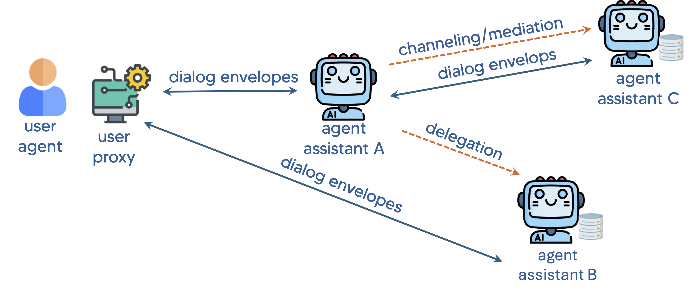

# Beaconforge

## An agentic AI framework designed to enable multi-agent collaboration through NLP (Natural Language Processing)-based APIs.

# Overview
Beaconforce provides a Python framework for initializing an interoperable intelligent assistant that uses the Open Voice Interoperability Initiative specifications. 

See please the following Arxiv papers for more information about the specifications: 
https://arxiv.org/abs/2407.19438 
https://arxiv.org/abs/2411.05828 

# Requirements
...

# Quickstart

