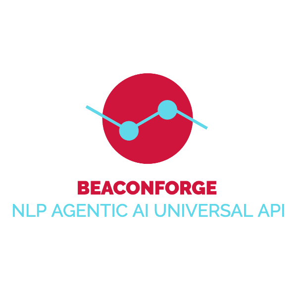

# Beaconforge

## An agentic AI framework designed to enable multi-agent collaboration through NLP (Natural Language Processing)-based APIs.

# Overview
Beaconforge provides a Python framework for initializing an interoperable intelligent assistant that uses the Open Voice Interoperability Initiative specifications. 

 
See please the following Arxiv papers for more information about the specifications: 
<a href="https://arxiv.org/abs/2407.19438" target="_blank">Link to Agentic Research Paper #1</a> 
<a href="https://arxiv.org/abs/2411.05828" target="_blank">Link to Multi-party Research Paper #2</a> 
The official specifications can be found in  
https://github.com/open-voice-interoperability/docs/tree/main/specifications

# Requirements
...

# Quickstart

