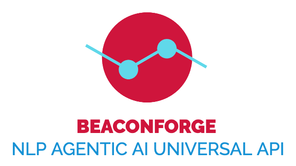

# Beaconforge

### An agentic AI framework designed to enable multi-agent collaboration through NLP (Natural Language Processing)-based APIs.

# Overview
Beaconforge provides a Python framework (with future plans for other languages) for initializing an interoperable intelligent assistant that uses the Open Voice Interoperability Initiative specifications. 

 

The picture shows a user interacting with several assistants, agent assistant a, agent assistant b and agent assistant c, which all communicate through the Open Voice specifications. The code in this repository will enable you to create your own versions of these assistants.

See please the following Arxiv papers for more information about the specifications: 
<a href="https://arxiv.org/abs/2407.19438" target="_blank">Link to Agentic Research Paper #1</a> 
<a href="https://arxiv.org/abs/2411.05828" target="_blank">Link to Multi-party Research Paper #2</a> 
The official specifications can be found in  
https://github.com/open-voice-interoperability/docs/tree/main/specifications

# V2
Version 2 of the repository provides a Multiagent Python framework suitable for Pythonanywhere with 3 x AI Agents ready to be used.

* Pete: a general purpose agent to provide general infos
* Athena: a smart library agent to provide information about Books and Authors
* Zeus: an AI agent using the Openweathermap.org APIs to provide weather infos

A frontend Orchestrator Intent-Based takes care of the routing among AI Agents, based on the user intents.