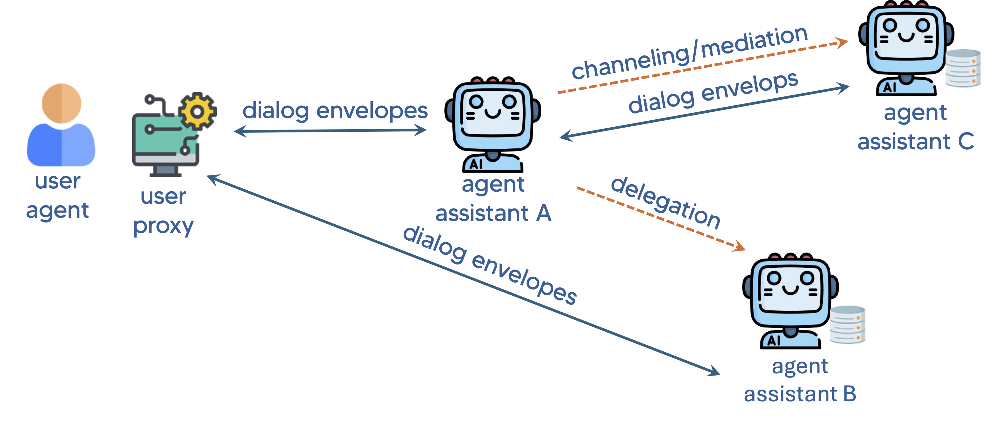
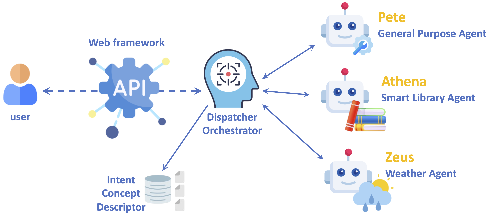
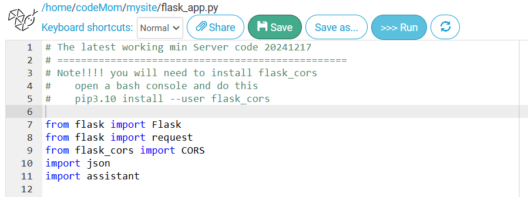

# Beaconforge V2


### An agentic AI framework designed to enable multi-agent collaboration through NLP (Natural Language Processing)-based APIs.

# Overview
Beaconforge provides a Python framework (with future plans for other languages) for initializing an interoperable intelligent assistant that uses the Open Voice Interoperability Initiative specifications.<br />

<br />

The picture shows a user interacting with several assistants, agent assistant a, agent assistant b and agent assistant c, which all communicate through the Open Voice specifications. The code in this repository will enable you to create your own versions of these assistants.

See please the following Arxiv papers for more information about the specifications:<br />
<a href="https://arxiv.org/abs/2407.19438" target="_blank">Link to Agentic Research Paper #1</a><br />
<a href="https://arxiv.org/abs/2411.05828" target="_blank">Link to Multi-party Research Paper #2</a><br />
The official specifications can be found in <br/>
https://github.com/open-voice-interoperability/docs/tree/main/specifications


# V2
Version 2 of the repository provides a Multiagent Python framework suitable for Pythonanywhere with 3 x AI Agents ready to be used.

* Pete: a general purpose agent to provide general infos
* Athena: a smart library agent to provide information about Books and Authors
* Zeus: an AI agent using the Openweathermap.org APIs to provide weather infos

A frontend Orchestrator Intent-Based takes care of the routing among AI Agents, based on the user intents.



# Quickstart

### PythonAnywhere-hosted Assistant

The PythonAnywhere-hosted assistant (PythonAnywhere folder) consists of two main files: `flask_app.py` and `assistant.py`. Two additional files `intentContents.json` and `weather_api.py` provide additional functionality and a weather example (how to use an external API) to help build a simple OVON server. This assistant is pre-built to respond to various events, including invites, user utterances, and manifest requests. It demonstrates how to integrate the assistant with a Flask server. This directory "PythonAnywhere" can be copied to pythonanywhere.com and will run on a free account (that you will need to set up). You must follow the instructions at the top of `flask_app.py`.
```
# Note!!!! you will need to install flask_cors
#    open a bash console and do this
#    pip3.13 install --user flask_cors
```
You will only need to do this once after creating you PythonAnywhere account. This will be explained further later in this document.

### Using the OVON messages

You will need a way to send OVON messages to your assistant server. There are several ways to accomplish this. As a simple test, you can use a tool like **Postman** (see <a href="using_postman.md" target="_blank">Using Postman</a> for more information)  or **curl** to send OVON messages directly to your assistant server by HTTP POST. You can also use a client to provide a user interface and to send OVON messages to the server assistant from the client. The **open-voice-sandbox** is a voice and text client that will inteact with OVON assistants and it has tools to examine the messages and flow of your interactions. Download the Sandbox [here](https://github.com/open-voice-interoperability/open-voice-sandbox).

You are encouraged to use the code in the sandbox to build your own client. 

###### IMPORTANT NOTES:  The pythonanywhere server template we have created in the sandbox uses `weather_api.py` to serve Zeus (the weather agent), and the `OpenAI API` to serve Athena (smart library agent) and Pete (general purpose agent). Therefore if you are copying the code over please make sure to add that file to your structure as well as insuring your own API key from [here]( https://openweathermap.org/api) is present in your `wsgi.py` file (see please the Web section tab of your Pythonanywhere environment).

## Beaconforge  setup

### Code Overview
* The Flask server listens for POST requests on the `/` endpoint.
* It imports the assistant module (`assistant.py`) for response generation.
* The `generate_response` function is called to handle incoming OVON messages.
* The `intentConcepts.json` file is used for "word-spotting" by the **search_intent(input_text)** function in `assistant.py. It is a basic tool to detect very basic intents that can be used by your assistant. You should not play with this file just yet, but later (after the basic server is running) you can add a new concept by just adding a new concepts array element e.g.
```
    {
      "name": "amphibian",
      "examples": [
        "frog",
        "toad",
        "salamander",
        "newt",
        "caecilian"
      ]
    },
```
When the input_text contains **any** of the examples it will return "amphibian".
### assistant.py
### Code Overview
* The assistant file defines a `generate_response` function that processes OVON events and generates appropriate responses. 
* It recognizes different **event** types, such as **invite**, **utterance**, and **requestManifest** adapting responses accordingly.
* This particular simple assistant checks for greetings and specific keywords (e.g., "weather") to provide context-aware responses.


### Customization
* Modify `greetings` and `weather_terms` examples (or add new `concepts`) to tailor the assistant's behavior to specific needs. 
* Adapt the response logic based on specific use cases.

## Creating your own PythonAnywhere assistant
#### 1. Create a PythonAnywhere account
* If you don't have a PythonAnywhere account, sign up at [PythonAnywhere](https://www.pythonanywhere.com/)
#### 2. Access PythonAnywhere 
* Log in to  your PythonAnywhere account and navigate to the Dashboard

* Install Dependencies: **Make sure** to install the required dependencies by opening a Bash console and running the following command:
    * ``` pip3.13 install --user flask_cors```
    * ``` pip3.13 install --user openai```

#### 3. Create Web App in PythonAnywhere 
* Navigate to the Web tab and follow the steps they show to create a web app.
* Once finished, it will create a new folder named `/mysite`, this is where we will be working and uploading the files. Select `flask_app` as a framework.
#### 4. Upload Your Files
* Navigate to the "mysite" directory (go to "Files" tab) and upload your assistant files (`flask_app.py`, `assistant.py`, `weather_api.py`, and `intentConcepts.json`) that are found in the beaconforge/PythonAnywhere directory.
* Note: You should modify the "manifest" section of code in `assistant.py` to describe your assistant. It will simplify adding your assistant to the sandbox client, and it is required for clients in the future to locate your assistant (think web search to find a site).
* What is in the file:
```
        manifestRequestEvent = {
            "eventType": "publishManifest",
            "parameters": {
                "manifest" : {
                    "identification":
                    {
                        "serviceEndpoint": "http://someAcctName.pythonanywhere.com",
                        "organization": "Sandbox_LFAI",
                        "conversationalName": "Pete",
                        "serviceName": "Python Anywhere",
                        "role": "Basic assistant",
                        "synopsis" : "I am a pretty dumb assistant."
                    },
                    "capabilities": [
                        {
                            "keyphrases": [
                                "dumb",
                                "basic",
                                "lazy"
                            ],
                            "languages": [
                                "en-us"
                            ],
                            "descriptions": [
                                "just some test code to test manifest messages",
                                "simple minded unit test code"
                            ],
                            "supportedLayers": [
                                "text"
                            ]
                        }
                    ]
                }
            }
        }
```
* What you should personalize for your assistant (the XXXXXXX values):
```
        manifestRequestEvent = {
            "eventType": "publishManifest",
            "parameters": {
                "manifest" : {
                    "identification":
                    {
                        "serviceEndpoint": "http://XXXXXXXX.pythonanywhere.com",
                        "organization": "XXXXXXX",
                        "conversationalName": "XXXXXXX",
                        "serviceName": "XXXXXXXX",
                        "role": "XXXXXXXX",
                        "synopsis" : "XXXXXXXXXXXXXXXXXXXXXXXXXX"
                    },
                    "capabilities": [
                        {
                            "keyphrases": [
                                "XXXXX",
                                "XXXXXX",
                                "XXX"
                            ],
                            "languages": [
                                "en-us"
                            ],
                            "descriptions": [
                                "XXXXXXXXXXXXXXXXXXXXX",
                                "XXXXXXXXXXXXXXXXXXXXXX"
                            ],
                            "supportedLayers": [
                                "text"
                            ]
                        }
                    ]
                }
            }
        }
```
#### 5. Open Bash Console
* Navigate to "Consoles" tab and open a Bash console.
#### 6. Install Dependencies
* In the Bash console, install the necessary dependencies. For example, we need to use Flask and Flask-CORS, run:
```pip3.13 install --user flask flask-cors```
* If your assistant will use any other special imports then install them now in the same way.
#### 7. Running the Server
* From the "Files" tab, locate the `mysite/flask_app.py` file, and click on it to open it in the PythonAnywhere editor.
* You **must** upload your server to the pythonanywhere host server. This is not obvious but the `>>>Run` button **only** runs it in your dedicated space. The "swirly-arrows" button **uploads** it to be served on the internet. This may take 10-30 seconds. The last button (just to the right of the `>>>Run` button) is what you want.



* At this point you should be able to test if it is running. It will be accessable at `http://yourAcctName.pythonanywhere.com`
* You can do a postman or curl test now.
#### 8. Now is a good time to clone the **open-voice-sandbox** mentioned above.
* It will allow you to access your assistant via voice or text. But you will have to add your assistant to the sandbox list of assistants via the Add_Existing_Assistant function.
# 9. Basic tests with Postman
### Example 1: Get the Manifest
* POST request to: http://youraccount.pythonanywhere.com
* Body:
```
{
 "ovon": {
    "schema": {
      "version": "0.9.3"
    },
    "conversation": {
      "id": "31050879662407560061859425913208"
    },
    "sender": {
      "from": "https://someBot.com"
    },
    "events": [
      {
        "to": "https://youraccount.pythonanywhere.com",
        "eventType": "requestManifest"
      }
    ]
  }
}
```
* Expected answer:
```
{"ovon": {"conversation": {"id": "31050879662407560061859425913208"}, "schema": {"version": "0.9.0", "url":
"not_published_yet"}, "sender": {"from": "http://youraccount.pythonanywhere.com"}, "events": [{"eventType":
"publishManifest", "parameters": {"manifest": {"identification": {"serviceEndpoint":
"http://didacus.pythonanywhere.com", "organization": "Sandbox_LFAI", "conversationalName": "Dieguito", "serviceName":
"Python Anywhere", "role": "Basic assistant", "synopsis": "I am a pretty general purpose assistant specialized in
anything."}, "capabilities": [{"keyphrases": ["dumb", "basic", "lazy"], "languages": ["en-us"], "descriptions":
["Didacus test code", "Didacus simple minded unit test code"], "supportedLayers": ["text"]}]}}}, {"eventType":
"utterance", "parameters": {"dialogEvent": {"speakerId": "assistant", "span": {"startTime": "2025-01-10 15:13:44"},
"features": {"text": {"mimeType": "text/plain", "tokens": [{"value": "Thanks for asking, here is my manifest."}]}}}}}]}}
```
### Example 2: Send an utterance
* POST request to: http://youraccount.pythonanywhere.com
* Body:
```
{
  "ovon": {
    "schema": {
      "version": "0.9.4",
      "url": "https://openvoicenetwork.org/schema/dialog-envelope.json"
    },
    "conversation": {
      "id": "conv_1699812834794"
    },
    "sender": {
      "from": "https://organization_url_from",
      "reply-to": "https://organization_url_to"
    },
    "responseCode": {
      "code": 200,
      "description": "OK"
    },
    "events": [
      {
        "eventType": "utterance",
        "parameters": {
          "dialogEvent": {
            "speakerId": "humanOrAssistantID",
            "span": { "startTime": "2023-11-14 02:06:07+00:00" },
            "features": {
              "text": {
                "mimeType": "text/plain",
                "tokens": [
                  {
                    "value": "Tell me about the book The Heart of Darkness please"
                  }
                ]
              }
            }
          }
        }
      }
    ]
  }
}
```
* Expected answer:
```
{"ovon": {"conversation": {"id": "conv_1699812834794"}, "schema": {"version": "0.9.4", "url": "not_published_yet"},
"sender": {"from": "http://youracount.pythonanywhere.com"}, "events": [{"eventType": "utterance", "parameters":
{"dialogEvent": {"speakerId": "assistant", "span": {"startTime": "2025-04-15 07:26:16"}, "features": {"text":
{"mimeType": "text/plain", "tokens": [{"value": "Hello, I'm Athena, your Smart Library Agent. I'm glad you're interested
in \"Heart of Darkness\". It is an intense and powerful novella written by Joseph Conrad, first published in serial form
in 1899 and then in book form in 1902.\n\nThe story recounts the travel of Charles Marlow, the protagonist, up the Congo
River in Central Africa, as an agent for a Belgian ivory trading company. The novel is a complex exploration of the
attitudes people hold on what constitutes a barbarian versus a civilized society, and the attitudes on colonialism and
racism that were part and parcel of European imperialism.\n\n\"Heart of Darkness\" is notable for its narrative
structure, as it's a story within a story. Conrad uses innovative, impressionistic methods of description that were new
and exciting at the time of publication and have since become hallmarks of modernist literature.\n\nPlease note that
\"Heart of Darkness\" has been both praised and criticized for its handling of the colonial subjects and its portrayal
of Africa and Africans. It is a profound and influential work that continues to inspire discussions and
analyses."}]}}}}}]}}
```