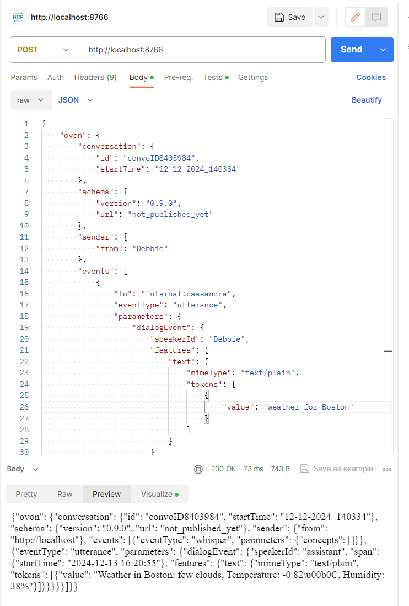

# Testing an assistant server with Postman #

Postman <https://www.postman.com/> is a popular tool for testing APIs that provides an easy-to-use user interface for specifying HTTP parameters, sending requests to a server, and viewing the results.

Assuming that you have installed Postman and know the basics of how to use it, you can send OVON messages to an OVON assistant based on the following information:

1. The HTTP method is POST
2. The server location is wherever your server is running, for example, <http://localhost:8766>
3. The body of the request is an OVON message (JSON)
4. Under "Headers", the Content-Type should be set to "application/json"
5. Click "Send" to send your HTTP request to your server
6. You will see the response below the request

Here's a Postman screen showing an OVON request and response

 
