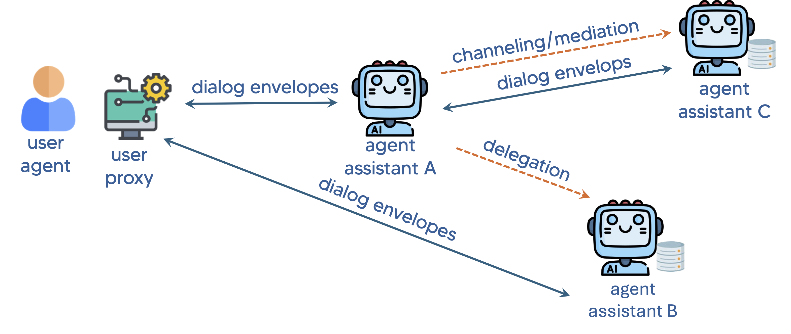

# Beaconforge V3


### An agentic AI framework designed to enable multi-agent collaboration through NLP (Natural Language Processing)-based APIs Open-Floor standard compliant.

# Overview
Beaconforge provides a Python framework (with future plans for other languages) for initializing an interoperable intelligent assistant that uses the Open Floor specifications:<br />
https://github.com/open-voice-interoperability/openfloor-docs/tree/main/specifications
<br />

<br />

The picture shows a user interacting with several assistants, agent assistant a, agent assistant b and agent assistant c, which all communicate through the Open Voice specifications. The code in this repository will enable you to create your own versions of these assistants.

See please the following Arxiv papers for more information about the specifications:<br />
<a href="https://arxiv.org/abs/2407.19438" target="_blank">Link to Agentic Research Paper #1</a><br />
<a href="https://arxiv.org/abs/2411.05828" target="_blank">Link to Multi-party Research Paper #2</a><br />
The official specifications can be found in <br/>
https://github.com/open-voice-interoperability/docs/tree/main/specifications


# V3
Version 3 of the repository provides a Multiagent Python framework suitable for Pythonanywhere with 3 x AI Agents ready to be used according to the Open Floor Specifications.

* Pete: a general purpose agent to provide general infos
* Athena: a smart library agent to provide information about Books and Authors
* Zeus: an AI agent using the Openweathermap.org APIs to provide weather infos

A frontend Orchestrator Intent-Based takes care of the routing among AI Agents, based on the user intents.


# Quickstart

### PythonAnywhere-hosted Assistant

The PythonAnywhere-hosted assistant (PythonAnywhere folder) consists of two main files: `flask_app.py` and `assistant.py`. Two additional files `intentContents.json` and `weather_api.py` provide additional functionality and a weather example (how to use an external API) to help build a simple OVON server. This assistant is pre-built to respond to various events, including invites, user utterances, and manifest requests. It demonstrates how to integrate the assistant with a Flask server. This directory "PythonAnywhere" can be copied to pythonanywhere.com and will run on a free account (that you will need to set up). You must follow the instructions at the top of `flask_app.py`.
```
# Note!!!! you will need to install flask_cors
#    open a bash console and do this
#    pip3.13 install --user flask_cors
```
You will only need to do this once after creating you PythonAnywhere account. This will be explained further later in this document.

### Using the OVON messages

You will need a way to send OVON messages to your assistant server. There are several ways to accomplish this. As a simple test, you can use a tool like **Postman** (see <a href="using_postman.md" target="_blank">Using Postman</a> for more information)  or **curl** to send OVON messages directly to your assistant server by HTTP POST. You can also use a client to provide a user interface and to send OVON messages to the server assistant from the client. The **open-voice-sandbox** is a voice and text client that will inteact with OVON assistants and it has tools to examine the messages and flow of your interactions. Download the Sandbox [here](https://github.com/open-voice-interoperability/open-voice-sandbox).

You are encouraged to use the code in the sandbox to build your own client. 

###### IMPORTANT NOTES:  The pythonanywhere server template we have created in the sandbox uses `weather_api.py` to serve Zeus (the weather agent), and the `OpenAI API` to serve Athena (smart library agent) and Pete (general purpose agent). Therefore if you are copying the code over please make sure to add that file to your structure as well as insuring your own API key from [here]( https://openweathermap.org/api) is present in your `wsgi.py` file (see please the Web section tab of your Pythonanywhere environment).

## Beaconforge  setup

### Code Overview
* The Flask server listens for POST requests on the `/` endpoint.
* It imports the assistant module (`assistant.py`) for response generation.
* The `generate_response` function is called to handle incoming OVON messages.
* The `intentConcepts.json` file is used for "word-spotting" by the **search_intent(input_text)** function in `assistant.py. It is a basic tool to detect very basic intents that can be used by your assistant. You should not play with this file just yet, but later (after the basic server is running) you can add a new concept by just adding a new concepts array element e.g.
```
    {
      "name": "amphibian",
      "examples": [
        "frog",
        "toad",
        "salamander",
        "newt",
        "caecilian"
      ]
    },
```
When the input_text contains **any** of the examples it will return "amphibian".
### assistant.py
### Code Overview
* The assistant file defines a `generate_response` function that processes OVON events and generates appropriate responses. 
* It recognizes different **event** types, such as **invite**, **utterance**, and **requestManifest** adapting responses accordingly.
* This particular simple assistant checks for greetings and specific keywords (e.g., "weather") to provide context-aware responses.


### Customization
* Modify `greetings` and `weather_terms` examples (or add new `concepts`) to tailor the assistant's behavior to specific needs. 
* Adapt the response logic based on specific use cases.

## Creating your own PythonAnywhere assistant
#### 1. Create a PythonAnywhere account
* If you don't have a PythonAnywhere account, sign up at [PythonAnywhere](https://www.pythonanywhere.com/)
#### 2. Access PythonAnywhere 
* Log in to  your PythonAnywhere account and navigate to the Dashboard

* Install Dependencies: **Make sure** to install the required dependencies by opening a Bash console and running the following command:
    * ``` pip3.13 install --user flask_cors```
    * ``` pip3.13 install --user openai```

#### 3. Create Web App in PythonAnywhere 
* Navigate to the Web tab and follow the steps they show to create a web app.
* Once finished, it will create a new folder named `/mysite`, this is where we will be working and uploading the files. Select `flask_app` as a framework.
#### 4. Upload Your Files
* Navigate to the "mysite" directory (go to "Files" tab) and upload your assistant files (`flask_app.py`, `assistant.py`, `weather_api.py`, and `intentConcepts.json`) that are found in the beaconforge/PythonAnywhere directory.
* Note: You should modify the "manifest" section of code in `assistant.py` to describe your assistant. It will simplify adding your assistant to the sandbox client, and it is required for clients in the future to locate your assistant (think web search to find a site).
* What is in the file:
```
        manifestRequestEvent = {
            "eventType": "publishManifest",
            "parameters": {
                "manifest" : {
                    "identification":
                    {
                        "serviceEndpoint": "http://someAcctName.pythonanywhere.com",
                        "organization": "Sandbox_LFAI",
                        "conversationalName": "Pete",
                        "serviceName": "Python Anywhere",
                        "role": "Basic assistant",
                        "synopsis" : "I am a pretty dumb assistant."
                    },
                    "capabilities": [
                        {
                            "keyphrases": [
                                "dumb",
                                "basic",
                                "lazy"
                            ],
                            "languages": [
                                "en-us"
                            ],
                            "descriptions": [
                                "just some test code to test manifest messages",
                                "simple minded unit test code"
                            ],
                            "supportedLayers": [
                                "text"
                            ]
                        }
                    ]
                }
            }
        }
```
* What you should personalize for your assistant (the XXXXXXX values):
```
        manifestRequestEvent = {
            "eventType": "publishManifest",
            "parameters": {
                "manifest" : {
                    "identification":
                    {
                        "serviceEndpoint": "http://XXXXXXXX.pythonanywhere.com",
                        "organization": "XXXXXXX",
                        "conversationalName": "XXXXXXX",
                        "serviceName": "XXXXXXXX",
                        "role": "XXXXXXXX",
                        "synopsis" : "XXXXXXXXXXXXXXXXXXXXXXXXXX"
                    },
                    "capabilities": [
                        {
                            "keyphrases": [
                                "XXXXX",
                                "XXXXXX",
                                "XXX"
                            ],
                            "languages": [
                                "en-us"
                            ],
                            "descriptions": [
                                "XXXXXXXXXXXXXXXXXXXXX",
                                "XXXXXXXXXXXXXXXXXXXXXX"
                            ],
                            "supportedLayers": [
                                "text"
                            ]
                        }
                    ]
                }
            }
        }
```
#### 5. Open Bash Console
* Navigate to "Consoles" tab and open a Bash console.
#### 6. Install Dependencies
* In the Bash console, install the necessary dependencies. For example, we need to use Flask and Flask-CORS, run:
```pip3.13 install --user flask flask-cors```
* If your assistant will use any other special imports then install them now in the same way.
#### 7. Running the Server
* From the "Files" tab, locate the `mysite/flask_app.py` file, and click on it to open it in the PythonAnywhere editor.
* You **must** upload your server to the pythonanywhere host server. This is not obvious but the `>>>Run` button **only** runs it in your dedicated space. The "swirly-arrows" button **uploads** it to be served on the internet. This may take 10-30 seconds. The last button (just to the right of the `>>>Run` button) is what you want.


* At this point you should be able to test if it is running. It will be accessable at `http://yourAcctName.pythonanywhere.com`
* You can do a postman or curl test now.
# 8. Basic tests with Postman
### Example 1: Get the Manifest from the General Purpose AI Agent (Pete)
* POST request to: http://youraccount.pythonanywhere.com
* Body:
```
{
  "openFloor": {
    "schema": {
      "version": "1.0.0"      
    },
    "conversation": {
      "id": "31050879662407560061859425913208"
    },
    "sender": {
      "serviceUrl": "https://someBot.com",
      "speakerUri": "tag:someBot.com,2025:4567"
    },
    "events": [
      {
        "eventType": "getManifests",
        "to": { 
          "serviceUrl": "http://youraccount.pythonanywhere.com"
        }
      }
    ]
  }
}
```
* Expected answer:
```
{"openFloor": {"conversation": {"id": "31050879662407560061859425913208"}, "schema": {"version": "1.0.0"}, "sender":
{"serviceUrl": "http://youraccount.pythonanywhere.com", "speakerUri": "tag:youraccount.pythonanywhere.com,2025:4567"},
"events": [{"eventType": "publishManifest", "parameters": {"manifest": {"identification": {"conversationalName": "pete",
"serviceName": "Personal Assistant", "organization": "BeaconForge", "serviceEndpoint":
"https://youraccount.pythonanywhere.com", "role": "Help with general tasks.", "synopsis": "Sort of like Jarvis in Iron
Man."}, "capabilities": {"keyphrases": ["personal", "assistant", "schedule", "appointments"], "languages": ["en-us"],
"descriptions": ["A general purpose administrative assistant.", "Help the human with basic daily tasks."],
"supportedLayers": ["text", "voice"]}}}}, {"eventType": "utterance", "parameters": {"dialogEvent": {"speakerUri":
"tag:youraccount.pythonanywhere.com,2025:4567", "span": {"startTime": "2025-05-22 16:41:44+02:00"}, "features": {"text":
{"mimeType": "text/plain", "tokens": [{"value": "Thanks for asking, here is my manifest."}]}}}}}]}}
```
### Example 2: Get the Manifest from a specific AI Agent (i.e. Athena)
* POST request to: http://youraccount.pythonanywhere.com
* Body:
```
{
  "openFloor": {
    "schema": {
      "version": "1.0.0"      
    },
    "conversation": {
      "id": "31050879662407560061859425913208"
    },
    "sender": {
      "serviceUrl": "https://someBot.com",
      "speakerUri": "tag:someBot.com,2025:4567"
    },
    "events": [
      {
        "eventType": "getManifests",
        "to": { 
          "serviceUrl": "http://youraccount.pythonanywhere.com/athena"
        }
      }
    ]
  }
}
```
* Expected answer:
```
{"openFloor": {"conversation": {"id": "31050879662407560061859425913208"}, "schema": {"version": "1.0.0"}, "sender":
{"serviceUrl": "http://youraccount.pythonanywhere.com", "speakerUri": "tag:youraccount.pythonanywhere.com,2025:4567"},
"events": [{"eventType": "publishManifest", "parameters": {"manifest": {"identification": {"conversationalName":
"athena", "serviceName": "Smart Library", "organization": "BeaconForge", "serviceEndpoint":
"https://youraccount.pythonanywhere.com", "role": "Provide information about books and authors", "synopsis": "Cradle of
knowledge"}, "capabilities": {"keyphrases": ["book", "author", "library", "literature", "novel"], "languages":
["en-us"], "descriptions": ["Provides book summaries and author bios.", "Ideal for literary inquiries and library-style
info."], "supportedLayers": ["text"]}}}}, {"eventType": "utterance", "parameters": {"dialogEvent": {"speakerUri":
"tag:youraccount.pythonanywhere.com,2025:4567", "span": {"startTime": "2025-05-22 16:42:00+02:00"}, "features": {"text":
{"mimeType": "text/plain", "tokens": [{"value": "Thanks for asking, here is my manifest."}]}}}}}]}}
```
### Example 3: Send a specific utterance.
* In this example the Orchestrator dispatcher recognizes that the utterance request is related to Book concepts, therefore it routes the message to be served by the Athena AI Agent.
* POST request to: http://youraccount.pythonanywhere.com
* Body:
```
{
  "openFloor": {
    "schema": {
      "version": "1.0.0"
    },
    "conversation": {
      "id": "31050879662407560061859425913208"
    },
    "sender": {
      "serviceUrl": "https://someBot.com",
      "speakerUri": "tag:someBot.com,2025:4567"
    },
    "events": [
      {
        "to": {
          "speakerUri": "tag:someBotOrPerson.com,2025:0021",
          "private": false
        },
        "eventType": "utterance",
        "parameters": {
          "dialogEvent": {
            "speakerUri": "tag:userproxy.acme.com,2025:b5y09lky5KU5",
            "span": {
              "startTime": "2023-06-14 02:06:07+00:00"
            },
            "features": {
              "text": {
                "mimeType": "text/plain",
                "tokens": [
                  {
                    "value": "Tell me about the book The Heart of Darkness please"
                  }
                ]
              }
            }
          }
        }
      }
    ]
  }
}
```
* Expected answer:
```
{"openFloor": {"conversation": {"id": "31050879662407560061859425913208"}, "schema": {"version": "1.0.0"}, "sender":
{"serviceUrl": "http://youraccount.pythonanywhere.com", "speakerUri": "tag:youraccount.pythonanywhere.com,2025:4567"},
"events": [{"eventType": "utterance", "parameters": {"dialogEvent": {"speakerUri":
"tag:youraccount.pythonanywhere.com,2025:4567", "span": {"startTime": "2025-05-22 16:44:24+02:00"}, "features": {"text":
{"mimeType": "text/plain", "tokens": [{"value": "Hello, I'm Athena, your Smart Library Agent. I'm pleased to assist you
with your query.\n\n\"The Heart of Darkness\" is a classic novel written by Joseph Conrad. Published in 1899, the book
is a captivating exploration of the harsh realities of European colonialism and imperialism. The narrative is about a
voyage up the Congo River into the Congo Free State, in the heart of Africa, by the story's narrator,
Marlow.\n\nMarlow's journey is a metaphorical one, exploring themes of good and evil, morality, and the depths of the
human soul. As he ventures deeper into the unknown, he is confronted with the darkness within himself and the horrifying
realization of what mankind is capable of.\n\nJoseph Conrad masterfully intertwines a psychological journey with a
physical one, resulting in a story that has left a lasting impression on literature. \"Heart of Darkness\" is often
regarded as an indictment of colonialism, and it raises profound questions about civilization, culture, and what it
means to be human.\n\nPlease note that while the book is highly acclaimed, it's also been criticized for its depiction
of Africa and Africans. Conrad's portrayal reflects the prejudices of his time, and contemporary readers often discuss
these issues while studying the book. \n\nRemember, the story is dense and symbolic, so it might require careful and
patient reading. But it's a rewarding experience for those who appreciate its themes and Conrad's skillful, atmospheric
prose."}]}}}}}]}}
```
### Example 4: Send a general utterance.
* In this example the Orchestrator dispatcher recognizes that the utterance request is generic and not related to any specific intent concepts, therefore it routes the message to be served by the Pete General Purpose AI Agent.
* POST request to: http://youraccount.pythonanywhere.com
* Body:
```
{
  "openFloor": {
    "schema": {
      "version": "1.0.0"
    },
    "conversation": {
      "id": "31050879662407560061859425913208"
    },
    "sender": {
      "serviceUrl": "https://someBot.com",
      "speakerUri": "tag:someBot.com,2025:4567"
    },
    "events": [
      {
        "to": {
          "speakerUri": "tag:someBotOrPerson.com,2025:0021"
        },
        "eventType": "utterance",
        "parameters": {
          "dialogEvent": {
            "speakerUri": "tag:userproxy.acme.com,2025:b5y09lky5KU5",
            "span": {
              "startTime": "2023-06-14 02:06:07+00:00"
            },
            "features": {
              "text": {
                "mimeType": "text/plain",
                "tokens": [
                  {
                    "value": "How can I get from London to Paris?"
                  }
                ]
              }
            }
          }
        }
      }
    ]
  }
}
```
* Expected answer:
```
{"openFloor": {"conversation": {"id": "31050879662407560061859425913208"}, "schema": {"version": "1.0.0"}, "sender":
{"serviceUrl": "http://youraccount.pythonanywhere.com", "speakerUri": "tag:youraccount.pythonanywhere.com,2025:4567"},
"events": [{"eventType": "utterance", "parameters": {"dialogEvent": {"speakerUri":
"tag:youraccount.pythonanywhere.com,2025:4567", "span": {"startTime": "2025-05-22 16:45:38+02:00"}, "features": {"text":
{"mimeType": "text/plain", "tokens": [{"value": "Hi, I'm Pete, your Personal Assistant. \n\nThere are several ways to
get from London to Paris:\n\n1. **By Train:** Eurostar offers high-speed train service from London St Pancras
International to Paris Gare du Nord in approximately 2 hours and 20 minutes. \n\n2. **By Plane:** Several airlines
operate flights from London to Paris. The flight time is approximately 1 hour, but keep in mind that you'll need to add
travel time to and from the airports. \n\n3. **By Bus:** Companies like Eurolines and FlixBus offer bus service from
London to Paris. This is typically the most budget-friendly option, but the journey can take upwards of 7-9 hours.\n\n4.
**By Car:** You can drive from London to Paris, but it's a bit more complicated because it involves a ferry crossing or
using the Eurotunnel. The total journey time can vary between 6-7 hours, depending on traffic and the chosen"}]}}}}}]}}
```
### Example 5: Send an invite to a specific agent (i.e. Athena)
* POST request to: http://youraccount.pythonanywhere.com
* Body:
```
{
  "openFloor": {
      "schema": {
        "version": "1.0.0"      
      },
      "conversation": {
        "id": "someUniqueIdCreatedByTheFirstParticipant"
      },
      "sender": {
          "speakerUri": "tag:botThatOfferedTheInvite.com,2025:4567"
      },
      "events": [
          {
              "eventType": "invite",
              "to": { 
                "serviceUrl": "https://youraccount.pythonanywhere.com/athena",
                "speakerUri": "tag:botBeingInvited.com,2025:1234"
              }
          }
      ]
  }
}
```
* Expected answer:
```
{"openFloor": {"conversation": {"id": "someUniqueIdCreatedByTheFirstParticipant"}, "schema": {"version": "1.0.0"},
"sender": {"serviceUrl": "http://youraccount.pythonanywhere.com", "speakerUri":
"tag:youraccount.pythonanywhere.com,2025:4567"}, "events": [{"eventType": "utterance", "parameters": {"dialogEvent":
{"speakerUri": "tag:youraccount.pythonanywhere.com,2025:4567", "span": {"startTime": "2025-05-22 16:46:52+02:00"},
"features": {"text": {"mimeType": "text/plain", "tokens": [{"value": "Hello, I'm Athena, your Smart Library Agent. Ask
me about books or authors!"}]}}}}}]}}
```
### Example 6: Ask about the weather to the Zeus Agent. 
* This action requires you to properly fill the utterance token with a request for weather and the whisper token value with the specific location (i.e. city), in order to properly call the external openweathermap API.
* POST request to: http://youraccount.pythonanywhere.com
* Body:
```
{
  "openFloor": {
    "schema": {
      "version": "1.0.0"
    },
    "conversation": {
      "id": "31050879662407560061859425913208"
    },
    "sender": {
      "serviceUrl": "https://someBot.com",
      "speakerUri": "tag:someBot.com,2025:4567"
    },
    "events": [
      {
        "to": {
          "speakerUri": "tag:someBotOrPerson.com,2025:0021",
          "private": false
        },
        "eventType": "utterance",
        "parameters": {
          "dialogEvent": {
            "speakerUri": "tag:userproxy.acme.com,2025:b5y09lky5KU5",
            "span": {
              "startTime": "2023-06-14 02:06:07+00:00"
            },
            "features": {
              "text": {
                "mimeType": "text/plain",
                "tokens": [
                  {
                    "value": "What's the weather like?"
                  }
                ]
              }
            }
          }
        }
      },
      {
        "to": {
          "speakerUri": "tag:someBotOrPerson.com,2025:0021",
          "private": true
        },
        "eventType": "utterance",
        "parameters": {
          "dialogEvent": {
            "speakerUri": "tag:userproxy.acme.com,2025:b5y09lky5KU5",
            "span": {
              "startTime": "2023-06-14 02:06:07+00:00"
            },
            "features": {
              "text": {
                "mimeType": "text/plain",
                "tokens": [
                  {
                    "value": "London"
                  }
                ]
              }
            }
          }
        }
      }
    ]
  }
}
```
* Expected answer:
```
{"openFloor": {"conversation": {"id": "31050879662407560061859425913208"}, "schema": {"version": "1.0.0"}, "sender":
{"serviceUrl": "http://youraccount.pythonanywhere.com", "speakerUri": "tag:youraccount.pythonanywhere.com,2025:4567"},
"events": [{"eventType": "utterance", "parameters": {"dialogEvent": {"speakerUri":
"tag:youraccount.pythonanywhere.com,2025:4567", "span": {"startTime": "2025-05-22 16:47:41+02:00"}, "features": {"text":
{"mimeType": "text/plain", "tokens": [{"value": "Weather in London: broken clouds, Temperature: 14.39\u00b0C, Humidity:
63%"}]}}}}}]}}
```