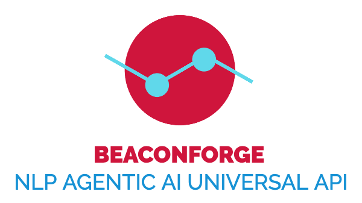
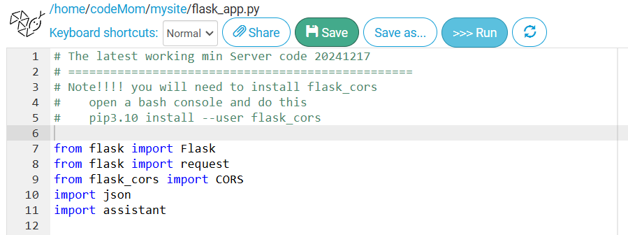

# BeaconForge PHP — A "Hello World" Open Floor Protocol Agent



> A minimal, deployable PHP implementation of an Open Floor Protocol (OFP) conversational agent. If your hosting site can run WordPress, it can run this agent.

---

## Table of Contents

- [What is BeaconForge PHP?](#what-is-beaconforge-php)
- [What is the Open Floor Protocol?](#what-is-the-open-floor-protocol)
- [Repository Files](#repository-files)
- [Deploying to a Shared Hosting Site](#deploying-to-a-shared-hosting-site)
- [Modifying agDef.json — The Agent Manifest](#modifying-agdefjson--the-agent-manifest)
- [Customizing myAgFun.php — Your Agent Logic](#customizing-myagfunphp--your-agent-logic)
- [The Parrot Example](#the-parrot-example)
- [Testing with Postman](#testing-with-postman)
- [How It Works (Under the Hood)](#how-it-works-under-the-hood)

---

## What is BeaconForge PHP?

BeaconForge PHP (`bfPHP`) is a **minimalist, production-ready PHP framework** for creating a conversational agent that participates in an [Open Floor Protocol (OFP)](https://github.com/open-voice-interoperability/openfloor-docs/tree/main/specifications) multi-agent conversation. It is part of the broader [open-voice-interoperability](https://github.com/open-voice-interoperability) project.

The goal of `bfPHP` is to lower the barrier of entry as far as possible. To build a functional OFP agent you only need to modify **two files**:

| File | Purpose |
|------|---------|
| `agDef.json` | Describes *who your agent is* — its identity, organization, and capabilities (the OFP manifest) |
| `myAgFun.php` | Implements *what your agent does* — how it responds to being invited to a conversation and to utterances it hears |

Everything else (`run.php`, `beaconforgeV3.php`) is the framework plumbing that handles OFP message parsing, formatting, routing, and persistence — you do not need to change those files.

---

## What is the Open Floor Protocol?

The Open Floor Protocol (OFP) is an open standard developed by the [Open Voice Interoperability Initiative — LF AI & Data Foundation](https://github.com/open-voice-interoperability). It defines how conversational agents discover one another and exchange messages using standard HTTP POST requests carrying JSON "conversation envelopes".

In an OFP conversation:

- A **floor manager** orchestrates which agents are active in a conversation.
- **Agents** are invited to join, hear utterances, and respond.
- Every agent exposes a single HTTP endpoint that accepts and returns OFP-formatted JSON.
- Agents publish a **manifest** describing their identity and capabilities, which allows discovery agents and floor managers to find the right agent for a task.

Key specifications:
- [Conversation Envelope Specification 1.0.1](https://github.com/open-voice-interoperability/openfloor-docs/tree/main/specifications/ConversationEnvelope/1.0.1)
- [Assistant Manifest Specification 1.0.1](https://github.com/open-voice-interoperability/openfloor-docs/tree/main/specifications/AssistantManifest/1.0.1) ← *defines the structure of `agDef.json`*

---

## Repository Files

```
bfPHP/
├── run.php              ← HTTP entry point. Upload this to your public directory.
├── beaconforgeV3.php    ← Core framework. Do not modify.
├── agDef.json           ← Your agent's manifest/definition. Edit this.
├── myAgFun.php          ← Your agent's conversational logic. Edit this.
└── Parrot/              ← Example persistent data from a test conversation
    ├── Parrot_test_convo_id.json
    └── Parrot_test_convo_id.log
```

### `run.php` — The HTTP Endpoint

This is the public-facing entry point. It:
1. Accepts a POST request containing an OFP JSON conversation envelope.
2. Passes it to the `simpleProcessOFP()` function in `beaconforgeV3.php`.
3. Returns the agent's OFP JSON response.

The two lines you may want to configure in `run.php`:

```php
$agentFunctionsFileName = 'myAgFun.php';   // Your agent logic file
$agentDefinitionJSON    = 'agDef.json';    // Your agent manifest file

$pathForPersistantStorage = '';            // See "Persistent Storage" below
```

### `beaconforgeV3.php` — The Framework

Contains all the OFP message handling, event parsing, manifest building, and persistent storage logic. This is the engine. You should not need to modify this file.

### `agDef.json` — The Agent Manifest

Defines your agent's identity and capabilities in a format compliant with the [OFP Assistant Manifest Specification 1.0.1](https://github.com/open-voice-interoperability/openfloor-docs/tree/main/specifications/AssistantManifest/1.0.1). See [Modifying agDef.json](#modifying-agdefjson--the-agent-manifest) for full details.

### `myAgFun.php` — Your Agent Logic

A PHP class that extends the base framework. Override the functions here to implement your agent's personality and behavior. See [Customizing myAgFun.php](#customizing-myagfunphp--your-agent-logic) for full details.

---

## Deploying to a Shared Hosting Site

### Requirements

- A PHP hosting account (shared hosting is fine — no special server software required)
- Any host that supports WordPress **already meets** the requirements for this agent
- PHP 7.4 or higher (PHP 8.x recommended)

### Directory Structure

Place all four PHP/JSON files together in a directory under your web server's `public` folder. A suggested path:

```
public/
└── ov1/
    └── ag/
        └── youragentname/
            ├── run.php
            ├── beaconforgeV3.php
            ├── agDef.json
            └── myAgFun.php
```

Your agent's endpoint URL will then be:

```
https://yourdomain.com/ov1/ag/youragentname/run.php
```

This URL must match the `serviceUrl` field in your `agDef.json` manifest (see below).

### Uploading Files

Use your host's file manager or an FTP client (such as FileZilla) to upload all four files to the directory you created.



### Persistent Storage

The framework automatically saves a JSON log file and a persistence state file for each conversation. These files are written to a subdirectory named after your agent's `conversationalName`.

**By default** (`$pathForPersistantStorage = ''`), these files are written inside the same directory as your PHP files (i.e., inside your `public` folder). This is acceptable for development and testing.

**For production**, it is strongly recommended to store these files **outside** your `public` directory so they are not directly web-accessible. To do this, edit the `$pathForPersistantStorage` line in `run.php`:

```php
// Example: if your public directory is at /home/username/public_html/
// store persistent data alongside it at /home/username/agentdata/
$pathForPersistantStorage = '../../../../agentdata/';
```

The framework will automatically create a subdirectory inside that path named after your agent (e.g., `agentdata/Parrot/`). Make sure the path exists and is writable by PHP.

### Verify It Works

After uploading, send a test POST request to `run.php` using [Postman](https://www.postman.com/) or `curl`. See [Testing with Postman](#testing-with-postman) for a ready-to-use request.

---

## Modifying agDef.json — The Agent Manifest

The `agDef.json` file is your agent's identity card. It is read once at startup and its contents are sent to the floor manager when a `getManifests` event is received.

The file follows the [OFP Assistant Manifest Specification 1.0.1](https://github.com/open-voice-interoperability/openfloor-docs/tree/main/specifications/AssistantManifest/1.0.1), wrapped in a `manifest` key for internal use by the framework.

### Structure

```json
{
    "manifest": {
        "identification": { ... },
        "character":      { ... },
        "capabilities":   { ... }
    }
}
```

---

### `identification` — Who Your Agent Is

This section is **mandatory** and defines the core identity of your agent. It is used by floor managers and discovery agents to find and address your agent.

| Field | Type | Mandatory | Description |
|-------|------|-----------|-------------|
| `speakerUri` | URI string | **Yes** | The unique, permanent identity of your agent. Use a URI format such as `tag:yourdomain.com,2026:myagent`. This never changes even if your endpoint URL changes. |
| `serviceUrl` | URL string | **Yes** | The full URL of your agent's `run.php` endpoint. **Must match your actual hosted URL.** |
| `conversationalName` | string | **Yes** | The name your agent introduces itself by and responds to when addressed by name. Doubles as the name of the persistent storage subdirectory. |
| `organization` | string | **Yes** | The name of the organization this agent represents. |
| `synopsis` | string | **Yes** | One sentence (under ~75 characters) describing what this agent does. Suitable for text-to-speech. |
| `department` | string | No | The area or department within the organization. |
| `role` | string | No | The agent's job title or role (e.g., "Weather Specialist", "Customer Support"). |
| `openFloorRoles` | dict | No | OFP roles this agent can perform. E.g., `{ "convener": true }` or `{ "discovery": true }`. |
| `ALTserviceUrl` | URL string | No | An alternative service URL. The framework will switch to this if a message is directed to it. |

**Example:**
```json
"identification": {
    "serviceUrl": "https://yourdomain.com/ov1/ag/myagent/run.php",
    "speakerUri": "tag:yourdomain.com,2026:myagent",
    "conversationalName": "Max",
    "role": "Customer Support Specialist",
    "department": "Support",
    "organization": "Acme Corp",
    "synopsis": "Customer support assistant for Acme Corp products."
}
```

> **Important:** The `speakerUri` is the *permanent identity* of your agent. The `serviceUrl` is *where it lives right now*. You can move your agent to a new URL without changing its identity.

---

### `character` — Voice and Appearance (BeaconForge Extension)

This section is a BeaconForge-specific extension (not part of the core OFP spec) that hints to compatible clients how to render and speak for this agent.

```json
"character": {
    "headShot": "aParrot.png",
    "voice": {
        "vendor": "MS_EDGE",
        "name": "Zira",
        "uri": "Microsoft Zira - English (United States)"
    }
}
```

---

### `capabilities` — What Your Agent Can Do

This section is **mandatory** and describes the services your agent provides. Discovery agents and floor managers use this to decide whether to invite your agent to handle a particular task.

Per the [OFP spec](https://github.com/open-voice-interoperability/openfloor-docs/tree/main/specifications/AssistantManifest/1.0.1), capabilities should be expressed as an **array** of capability objects (allowing an agent to offer multiple distinct capabilities):

| Field | Type | Description |
|-------|------|-------------|
| `keyphrases` | string array | **Mandatory.** Short searchable words or phrases that represent the topics your agent handles. Used by simple text-based search. |
| `languages` | string array | Languages supported, as [IETF BCP 47](https://www.rfc-editor.org/rfc/rfc5646.txt) tags (e.g., `"en-us"`, `"de-de"`). |
| `descriptions` | string array | **Mandatory.** Natural language sentences describing what your agent can do. Used by AI-powered discovery. |
| `supportedLayers` | dict of string arrays | The dialog event layers supported for input and output. Standard values: `"text"`, `"voice"`, `"ssml"`. Format: `{ "input": ["text"], "output": ["text"] }` |

**Example:**
```json
"capabilities": {
    "keyphrases": [
        "weather",
        "forecast",
        "temperature"
    ],
    "languages": ["en-us"],
    "descriptions": [
        "Provides current weather and forecasts for any city worldwide."
    ],
    "supportedLayers": ["text", "voice"]
}
```

---

### Complete agDef.json Example

```json
{
    "manifest": {
        "identification": {
            "serviceUrl": "https://yourdomain.com/ov1/ag/max/run.php",
            "speakerUri": "tag:yourdomain.com,2026:max",
            "conversationalName": "Max",
            "role": "Customer Support Specialist",
            "department": "Support",
            "organization": "Acme Corp",
            "synopsis": "Customer support assistant for Acme Corp products."
        },
        "character": {
            "headShot": "max_avatar.png",
            "voice": {
                "vendor": "MS_EDGE",
                "name": "Guy",
                "uri": "Microsoft Guy Online (Natural) - English (United States)"
            }
        },
        "capabilities": {
            "keyphrases": [
                "returns",
                "warranty",
                "product support",
                "troubleshooting"
            ],
            "languages": ["en-us"],
            "descriptions": [
                "Handles customer support inquiries for Acme Corp products including returns and warranties."
            ],
            "supportedLayers": ["text", "voice"]
        }
    }
}
```

---

## Customizing myAgFun.php — Your Agent Logic

The `myAgFun.php` file contains the `agentFunctions` class, which extends the `baseAgentFunctions` class from the framework. This is where you implement your agent's conversational behavior.

### The Three Core Methods

For a minimalist agent, you only need to implement **one method**. All three are shown below:

---

#### `inviteAction( $reason )` — Responding to an Invitation

Called when the floor manager invites your agent to join a conversation.

```php
public function inviteAction( $reason ) {
    // $reason: [string] why you were invited (often "none" for a general invite,
    //          or "@sentinel" for a sentinel/background agent role)
    $say = 'Hello! How can I help you today?';
    return $say;
}
```

Return the string you want your agent to say upon joining. Return an empty string `''` to join silently.

---

#### `utteranceAction( $heard, $fromUri, $directedToMe, $directedToSomeoneElse )` — Responding to Speech

**This is the most important method.** Called every time any participant in the conversation says something.

```php
public function utteranceAction( $heard, $fromUri, $directedToMe, $directedToSomeoneElse ) {
    // $heard              — [string] what was said
    // $fromUri            — [string] the speakerUri of who said it
    // $directedToMe       — [bool]   true if explicitly addressed to your agent,
    //                                OR if your conversationalName appears in the utterance
    // $directedToSomeoneElse — [bool] true if explicitly addressed to a different agent

    if ( $directedToMe ) {
        $say = 'You said: ' . $heard . '. Let me help with that!';
    } elseif ( $directedToSomeoneElse ) {
        $say = ''; // Stay silent — it wasn't meant for you
    } else {
        // Undirected utterance — broadcast to everyone
        $say = 'I heard: ' . $heard;
    }

    return $say; // Return '' to stay silent
}
```

> **Tip:** For a polite, well-behaved agent, respond only when `$directedToMe` is true and stay silent when `$directedToSomeoneElse` is true.

> **Name detection is automatic:** If your agent's `conversationalName` (from `agDef.json`) appears anywhere in the utterance, `$directedToMe` is automatically set to `true` by the framework.

---

#### `startUpAction()` and `wrapUpAction()` — Persistent State

Use these to manage state that persists across conversation turns. The `$this->persistObject` array is automatically saved to disk at the end of each turn and restored at the start of the next.

```php
public function startUpAction() {
    parent::startUpAction(); // REQUIRED — restores $this->persistObject

    if ( $this->persistObject == null ) { // First turn — initialize your state
        $this->persistObject = [
            'exchanges' => [],
            'userName'  => null,
        ];
    }
    // $this->persistObject is now available for the rest of this turn
}

public function wrapUpAction() {
    // Do any cleanup here before state is saved
    parent::wrapUpAction(); // REQUIRED — saves $this->persistObject
}
```

You can store anything JSON-serializable in `$this->persistObject`.

---

### Minimal Agent Template

The absolute minimum implementation for a functional agent:

```php
<?php
class agentFunctions extends baseAgentFunctions {

    public function __construct( $fileName ) {
        parent::__construct( $fileName );
    }

    public function startUpAction() {
        parent::startUpAction();
        if ( $this->persistObject == null ) {
            $this->persistObject = ['exchanges' => []];
        }
    }

    public function wrapUpAction() {
        parent::wrapUpAction();
    }

    public function inviteAction( $reason ) {
        return 'Hello! I am ready to assist.';
    }

    public function utteranceAction( $heard, $fromUri, $directedToMe, $directedToSomeoneElse ) {
        if ( !$directedToMe ) return ''; // Stay silent unless addressed

        // ---- YOUR LOGIC GOES HERE ----
        $say = 'You said: ' . $heard;
        // ---- END YOUR LOGIC ----------

        $this->persistObject['exchanges'][] = [
            'heard' => $heard,
            'said'  => $say
        ];
        return $say;
    }
}
?>
```

---

## The Parrot Example

The included `myAgFun.php` implements a **Parrot** agent — a simple demonstration agent that repeats back what it hears. It is the "Hello World" of OFP agents.

### Parrot Behavior

| Situation | Parrot's Response |
|-----------|-------------------|
| Invited to conversation | *"Thankyou for the invitation. got any crackers?"* |
| Utterance directed to Parrot | *"Thanks for referencing me! I heard you say [X]. Polly wants a cracker!"* |
| Utterance directed to someone else | *(silent)* |
| Undirected utterance | *"I still need a cracker, but I heard [X] and I am not sure if it was meant for me."* |

The `Parrot/` directory contains example output files from a real test conversation:

- **`Parrot_test_convo_id.json`** — The persistent state file, showing the exchanges the Parrot tracked across the conversation.
- **`Parrot_test_convo_id.log`** — The conversation log, showing timestamped events from the Parrot's perspective.

These files illustrate what the framework automatically creates in your persistent storage directory during a live conversation.

---

## Testing with Postman

[Postman](https://www.postman.com/) is a convenient tool for sending OFP messages to your agent endpoint without needing a full floor manager.

### Basic Test Request

- **Method:** `POST`
- **URL:** `https://yourdomain.com/ov1/ag/youragentname/run.php`
- **Headers:** `Content-Type: application/json`
- **Body (raw JSON):**

```json
{
    "openFloor": {
        "conversation": {
            "id": "test_convo_001"
        },
        "sender": {
            "speakerUri": "ofpSocketClient",
            "serviceUrl": "https://testclient.example.com"
        },
        "events": [
            {
                "eventType": "utterance",
                "parameters": {
                    "dialogEvent": {
                        "features": {
                            "text": {
                                "tokens": [
                                    { "value": "Hello Parrot, how are you?" }
                                ]
                            }
                        }
                    }
                }
            }
        ]
    }
}
```

### Testing the Manifest

To request your agent's manifest, send a `getManifests` event directed to your agent:

```json
{
    "openFloor": {
        "conversation": {
            "id": "test_convo_001"
        },
        "sender": {
            "speakerUri": "ofpSocketClient",
            "serviceUrl": "https://testclient.example.com"
        },
        "events": [
            {
                "eventType": "getManifests",
                "to": {
                    "speakerUri": "Parrot_beaconforge"
                }
            }
        ]
    }
}
```

### Testing an Invite

```json
{
    "openFloor": {
        "conversation": {
            "id": "test_convo_001"
        },
        "sender": {
            "speakerUri": "floorManager",
            "serviceUrl": "https://floormgr.example.com"
        },
        "events": [
            {
                "eventType": "invite",
                "to": {
                    "speakerUri": "Parrot_beaconforge"
                }
            }
        ]
    }
}
```

For a full Postman walkthrough, see the [using_postman.md](../using_postman.md) guide if available, or visit the [open-voice-sandbox](https://github.com/open-voice-interoperability/open-voice-sandbox) project for a complete OFP client.

---

## How It Works (Under the Hood)

Here is the request lifecycle for a single OFP message:

```
HTTP POST → run.php
               │
               ▼
    simpleProcessOFP() in beaconforgeV3.php
               │
               ├─ Loads agDef.json and instantiates agentFunctions (myAgFun.php)
               ├─ Restores persistent state from disk (startUpAction)
               ├─ Checks if the message was sent by this agent (ignores if so)
               │
               ├─ For each OFP event:
               │    ├─ "invite"        → calls inviteAction(), sends acceptInvite + utterance
               │    ├─ "utterance"     → calls utteranceAction(), sends utterance response
               │    └─ "getManifests"  → reads agDef.json, sends manifest reply
               │
               ├─ Saves persistent state to disk (wrapUpAction)
               └─ Returns OFP JSON response
```

The framework handles all OFP envelope formatting, sender/recipient routing, manifest serialization, and HTTP response construction. Your `myAgFun.php` code only ever deals with plain PHP strings and arrays.

---

## Further Reading

- [Open Floor Protocol Specifications](https://github.com/open-voice-interoperability/openfloor-docs/tree/main/specifications)
- [Assistant Manifest Spec 1.0.1](https://github.com/open-voice-interoperability/openfloor-docs/tree/main/specifications/AssistantManifest/1.0.1)
- [Conversation Envelope Spec 1.0.1](https://github.com/open-voice-interoperability/openfloor-docs/tree/main/specifications/ConversationEnvelope/1.0.1)
- [Open Voice Sandbox (OFP client)](https://github.com/open-voice-interoperability/open-voice-sandbox)
- [Agentic AI Research Paper](https://arxiv.org/abs/2407.19438)
- [Multi-party Conversation Research Paper](https://arxiv.org/abs/2411.05828)

---

*Part of the [BeaconForge](https://github.com/open-voice-interoperability/beaconforge) project — Open Voice Interoperability Initiative, LF AI & Data Foundation.*
*Author: Emmett Coin, 2026*
